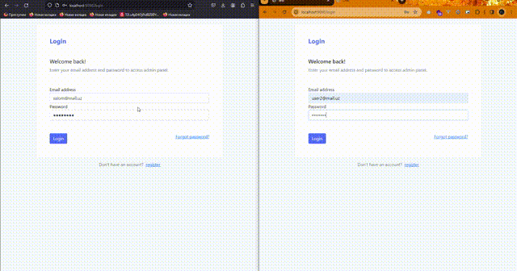

# Laravel simple chat messenger

This is a simple chat messenger built with laravel and pusher.

# Installation

1. Clone the project
2. Run `composer install` command
3. set configurations into `.env` file:

- set database configs

set pusher configs:

```bash
#...
BROADCAST_DRIVER=pusher
#...
PUSHER_APP_ID=<YOUR_PUSHER_ID>
PUSHER_APP_KEY=<YOUR_PUSHER_KEY>
PUSHER_APP_SECRET=<YOUR_PUSHER_SECRET>
#...
PUSHER_APP_CLUSTER=<YOUR_PUSHER_CLUSTER>
#...
```

4. generate key: `php artisan key:generate`
5. migrate database: `php artisan migrate`
6. Run the project `php -S localhost:<any_port> -t public`
7. First, register, then login :)



